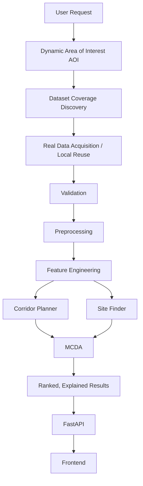
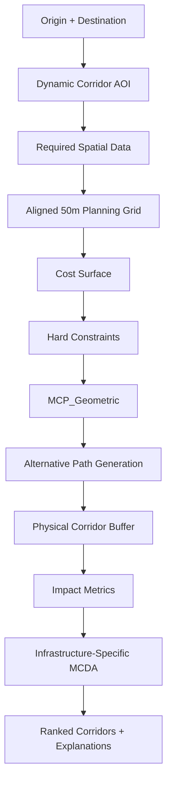
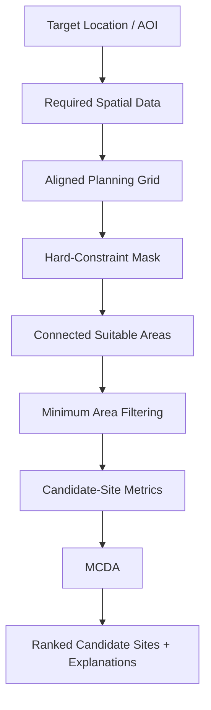
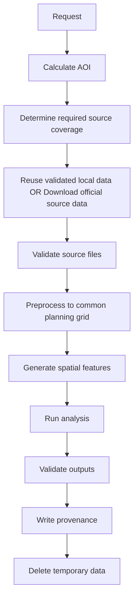
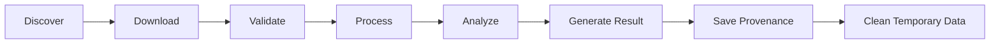
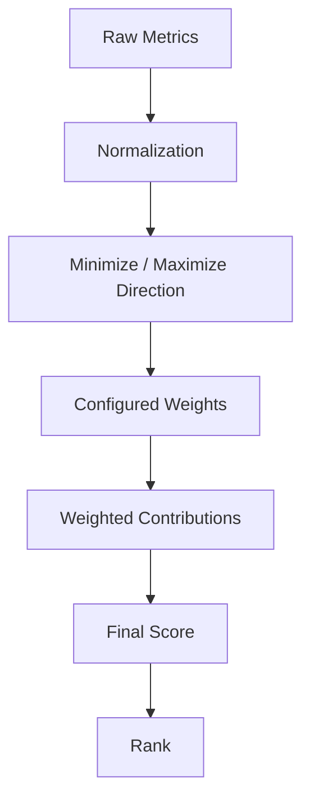
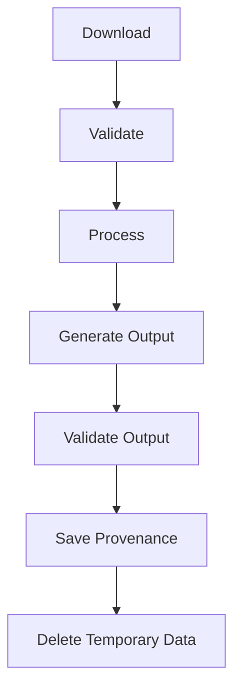
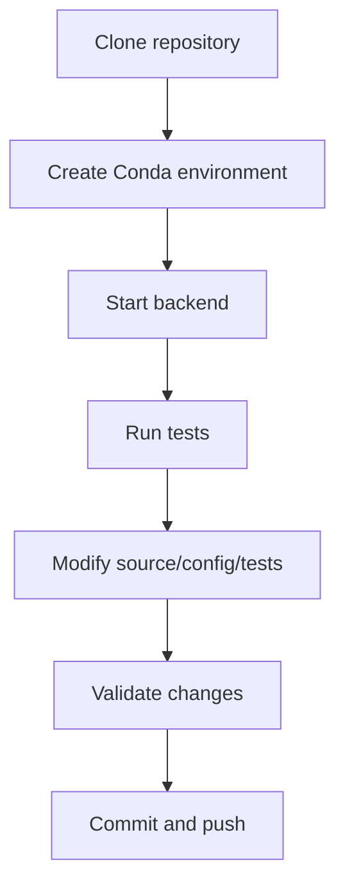

# InfraDrishti

**Geospatial Intelligence for Smarter Infrastructure Planning**

InfraDrishti is a geospatial decision-support platform for early-stage infrastructure planning. It combines real spatial datasets, deterministic GIS analysis, least-cost path computation, and transparent multi-criteria decision analysis (MCDA) to help identify candidate corridors for new linear infrastructure and suitable sites for facilities.

The platform is designed to answer two practical questions:

1. **Where should a new infrastructure corridor go between two locations?**
2. **Where is a suitable contiguous area for a new facility, given land, terrain, environmental, population, and infrastructure constraints?**

InfraDrishti is a planning-support system. It does not replace cadastral surveys, legal verification, detailed engineering, environmental clearance, or statutory acquisition procedures.

---

## Overview

Early-stage infrastructure planning usually requires combining many different spatial factors:

- terrain and slope
- buildings and built-up areas
- population exposure
- land cover
- rivers and surface water
- protected areas
- existing infrastructure
- proximity requirements
- land-acquisition friction proxies

These datasets often exist independently and are difficult to evaluate consistently.

InfraDrishti brings them into one reproducible spatial workflow:



The backend is designed to work with changing locations rather than being permanently tied to one demonstration area.

---

# Core Capabilities

## 1. Corridor Planner

The Corridor Planner finds candidate alignments for **new infrastructure** between an origin and destination.

### Inputs

- Origin
- Destination
- Infrastructure type
- Corridor width
- Number of requested alternatives
- Infrastructure-specific configuration

### Processing



The corridor engine uses `skimage.graph.MCP_Geometric` over a spatial cost surface. It is not an existing-road navigation system.

**Important:** InfraDrishti does not use OSRM or another road router to determine the new corridor. Existing roads and other infrastructure are contextual planning factors, not the routing graph that constrains the new alignment.

### Typical corridor metrics

Depending on the configured profile, the backend can evaluate metrics such as:

- route length
- corridor area
- building impact
- population exposure
- mean and maximum slope
- river crossings
- water overlap
- protected-area overlap
- forest/cropland land-cover impact
- proximity to existing infrastructure
- `acquisition_friction_index`

Candidate routes are ranked with transparent MCDA rather than an opaque machine-learning prediction.

---

## 2. Site Finder

The Site Finder identifies **spatially contiguous candidate areas** that satisfy minimum area and planning constraints.

### Inputs

- Target location or AOI
- Facility/infrastructure type
- Required area
- Mandatory constraints
- Preferred proximity requirements
- Infrastructure/facility profile

### Processing



The current site workflow uses connected-component analysis so candidate areas are spatially contiguous.

For the standard planning configuration:

```text
Required area: 50 acres
Equivalent area: approximately 202,342.8 m²
50m x 50m pixel: 2,500 m²
Minimum full pixels: 81
```

Candidate sites are **planning candidates**, not legal cadastral parcels.

The platform does not claim that a candidate site is legally available for acquisition.

---

# Real Spatial Data

InfraDrishti is designed around real geospatial datasets rather than fabricated training data or simulated production results.

## OpenStreetMap

Used for contextual infrastructure and built-environment information, including:

- buildings
- roads/highways
- railways
- stations
- power infrastructure
- other mapped features supported by the backend

OSM data is acquired through official Geofabrik extracts or reused from a validated local cache when coverage is sufficient.

OSM completeness depends on the quality and coverage of mapping in the requested area.

## Copernicus DEM GLO-30

Used for:

- elevation
- terrain analysis
- slope
- routing cost

Copernicus GLO-30 is a Digital Surface Model (DSM). It represents the surface, including features such as buildings and vegetation, rather than being a pure bare-earth terrain model.

The backend accounts for this dataset characteristic when interpreting terrain-derived results.

## ESA WorldCover 2021

Used for:

- land-cover classification
- built-up area exclusion
- cropland detection
- forest/tree-cover analysis
- land-cover based planning factors

The backend uses actual WorldCover class values rather than inventing land-use attributes.

## HydroRIVERS

Used for:

- river geometry
- river crossings
- hydrological context

## HydroBASINS

Used for:

- basin boundaries
- hydrological spatial context

## JRC Global Surface Water

Used for:

- surface-water occurrence
- water exclusion and water-related planning constraints

## WorldPop

Used for:

- population exposure estimation

Population values are treated as estimates from a gridded population dataset. They are not equivalent to an exact enumeration of residents or a legal displacement assessment.

## WDPA / WD-OECM

Used for:

- protected-area identification
- environmental hard constraints

Protected areas can be converted into a planning mask so that prohibited areas become unreachable to the routing/site-selection engine where configured as mandatory exclusions.

---

# Dynamic Data Pipeline

InfraDrishti is designed to support location-independent requests.

A new request follows this lifecycle:



This allows the same backend to support different regions without rewriting the analysis engine for every geography.

For example:

```text
Kolkata -> Delhi
Pune -> Mumbai
Indore -> Bhopal
Delhi -> Jaipur
```

can use the same downstream architecture.

---

# Development Mode and Dynamic Mode

The backend supports the concept of two data modes.

## Development Mode

If validated datasets already exist locally and genuinely cover the requested AOI, the backend can reuse them.

This prevents unnecessary re-downloads during development.

## Dynamic Mode

When the current local cache does not cover the requested AOI, the system discovers the necessary source coverage and downloads the required data for the request.

The intended lifecycle is:



Large geospatial source files are intentionally not stored in the public Git repository.

---

# Spatial Analysis

## Planning Grid

The system standardizes the core planning workflow on a **50 metre grid**.

The exact projected processing extent is determined from the request AOI.

All participating raster layers must be aligned so that they share compatible:

- coordinate reference system
- extent
- transform
- dimensions
- pixel size

Continuous and categorical datasets are processed using appropriate resampling strategies.

## Cost Surface

The Corridor Planner builds a spatial cost surface from real feature layers.

Examples of soft-cost factors include:

- slope
- population exposure
- building density
- land cover
- acquisition friction
- environmental/contextual factors

Hard constraints are represented as unreachable cells rather than arbitrary large finite costs.

This prevents the routing engine from choosing a prohibited location merely because it has a sufficiently large numerical penalty.

## Least-Cost Path

The base corridor search uses:

```text
skimage.graph.MCP_Geometric
```

The system can iterate with spatial penalties around existing candidate routes to search for additional alternatives.

The backend does not convert the problem into vehicle navigation or road-network shortest-path routing.

## Route Buffering

A corridor centerline is converted into a physical corridor footprint using the requested corridor width.

Impact metrics can therefore be calculated against the area of land that the infrastructure corridor would actually occupy rather than only against a mathematical centerline.

## Site Contiguity

Site suitability begins with a binary valid/invalid planning mask.

Connected components and deterministic spatial segmentation are then used to produce contiguous candidate areas.

Disconnected cells are not silently combined simply to reach the requested area threshold.

---

# Multi-Criteria Decision Analysis

InfraDrishti uses transparent weighted MCDA rather than a fabricated machine-learning model.

The generic scoring process is:



For each candidate, the backend can retain:

- raw metric values
- normalized values
- configured weights
- weighted contributions
- final MCDA score
- rank
- explanation/provenance

This allows a reviewer to understand why one candidate was ranked above another.

No training label for "best route" is fabricated, so the core ranking logic remains deterministic.

---

# Acquisition Friction Index

The backend uses the exact field name:

```text
acquisition_friction_index
```

It is a **spatial screening proxy**.

It is not:

- ownership probability
- acquisition probability
- legal ownership verification
- cadastral parcel identification
- compensation prediction
- financial acquisition cost
- legal risk assessment

The current documented heuristic is based on spatial indicators including:

```text
AFI = clip(
    0.30 × local_building_density
    + 0.50 × cropland_presence,
    0,
    1
)
```

Where:

- `local_building_density` is derived from mapped building presence over a local neighbourhood
- `cropland_presence` is derived from ESA WorldCover class 40
- WorldCover cropland is treated only as a land-cover class, not as an estimate of crop value

The index should be interpreted as a relative screening indicator, not as a legally or financially calibrated acquisition measure.

---

# Population Exposure

WorldPop is used as an estimate of population distribution.

Where the backend uses the current raster-neighbourhood implementation, the site population metric is represented as a documented approximation over a roughly 1 km square neighbourhood at 50 metre planning resolution.

This is not an exact census count and should not be interpreted as an exact displaced-population forecast.

---

# Hard Constraints

The spatial engines can enforce mandatory exclusions such as:

- protected areas
- permanent/specified surface water
- built-up areas where configured
- slope thresholds
- minimum site area
- other infrastructure-specific exclusions

Hard constraints are represented as excluded/unreachable regions.

Final candidates are validated against these restrictions before being returned.

---

# API

The backend exposes a FastAPI service.

The exact API contract should be treated as defined by the Pydantic request/response schemas in `backend/src`.

## Health

```http
GET /health
```

Returns backend health/readiness information when configured by the application router.

## Project Initialization

```http
POST /project
```

Initializes the project/request workspace.

## Corridor Planning

```http
POST /corridor/plan
```

Conceptual request:

```json
{
  "infrastructure_type": "highway",
  "origin": {
    "name": "Indore",
    "lon": 75.8577,
    "lat": 22.7196
  },
  "destination": {
    "name": "Bhopal",
    "lon": 77.4126,
    "lat": 23.2599
  },
  "corridor_width_m": 100,
  "n_routes": 3
}
```

The backend returns ranked candidate corridor geometries and associated metrics/explanations according to the current response schema.

## Site Finding

```http
POST /site/find
```

Conceptual request:

```json
{
  "facility_type": "industrial",
  "location": {
    "lat": 22.57,
    "lon": 88.36
  },
  "required_area_acres": 50
}
```

The backend returns ranked contiguous candidate sites according to the current response schema.

> Request and response examples above are illustrative of the interface shape. The authoritative field names and validation rules are the schemas implemented in `backend/src`.

---

# Outputs

Generated analysis artifacts are written to the project's output area.

Typical outputs include:

```text
routes.geojson
routes.csv
route_explanations.json
route_cost_surface.tif

sites.geojson
sites.csv
site_explanations.json

processing_summary.json
```

These are generated artifacts and are intentionally excluded from public Git.

The request-specific provenance records can include:

- request ID
- AOI
- datasets used
- source URLs
- source dates
- resolutions
- processing information
- output references
- cleanup status

---

# Repository Structure

The repository is organized so that source code, tests, scripts, configuration, runtime data, and the companion frontend remain separated.

```text
InfraDrishti/
├── backend/
│   ├── configs/
│   ├── outputs/
│   │   └── .gitkeep
│   ├── runtime/
│   │   └── .gitkeep
│   ├── scripts/
│   │   ├── diagnostics/
│   │   ├── maintenance/
│   │   ├── setup/
│   │   └── ...
│   ├── src/
│   │   ├── acquisition/
│   │   ├── api/
│   │   ├── core/
│   │   ├── corridor/
│   │   ├── geospatial/
│   │   ├── inference/
│   │   ├── models/
│   │   ├── preprocessing/
│   │   ├── scoring/
│   │   ├── site/
│   │   └── ...
│   ├── tests/
│   │   ├── integration/
│   │   └── ...
│   ├── ARCHITECTURE.md
│   ├── environment.yml
│   ├── RED_FLAGS.md
│   └── requirements.txt
│
├── frontend/
│   └── .gitkeep
│
├── .gitignore
└── README.md
```

Generated/runtime contents under `outputs/` and `runtime/` are ignored by Git.

---

# Installation

InfraDrishti uses geospatial Python libraries that depend on native components such as GDAL, GEOS, and PROJ.

For Windows, the supported setup path is the Conda environment defined by `backend/environment.yml`.

## Clone

```bash
git clone https://github.com/suryadeepbanerjee/InfraDrishti.git
cd InfraDrishti
```

## Create the Backend Environment

```bash
cd backend
conda env create -f environment.yml
conda activate intradrishti-env
```

Use the environment name declared in the current `environment.yml` if it differs.

## Why Conda?

On Windows, packages such as GeoPandas, Rasterio, Fiona, and related GDAL/PROJ/GEOS dependencies are more reliable when installed from compatible precompiled Conda packages.

A plain:

```bash
pip install -r requirements.txt
```

may fail on some Windows/Python combinations because of native geospatial dependencies.

---

# Environment Variables

Only variables actually used by the current backend should be configured.

For example, optional authenticated data providers may use environment variables such as:

```text
OT_API_KEY=<your-open-topography-key>
WDPA_API_TOKEN=<your-protected-planet-token>
```

Never commit real credentials.

Never place credentials in:

- source code
- configuration files committed to Git
- README examples
- public issues
- public pull requests

---

# Running the Backend

From the backend directory:

```bash
conda activate intradrishti-env
uvicorn src.main:app --host 0.0.0.0 --port 8000
```

The backend should then be available locally at:

```text
http://localhost:8000
```

API documentation is provided by FastAPI at the standard documentation routes when enabled by the application:

```text
http://localhost:8000/docs
http://localhost:8000/redoc
```

Verify backend health using the health endpoint implemented by the current application.

---

# Running Tests

From:

```text
InfraDrishti/backend
```

run:

```bash
pytest tests/
```

Tests are organized to distinguish lightweight validation from integration or real-data workflows where applicable.

Network-dependent or real-data tests may require:

- network access
- valid data-provider access
- local data/cache
- additional processing time

Do not assume that a unit-test run performs a complete real-data analysis.

---

# Data Handling

Large spatial datasets are intentionally excluded from the public Git repository.

Examples include:

- OSM PBF extracts
- WorldPop rasters
- DEM tiles
- WorldCover rasters
- WDPA archives
- HydroSHEDS archives
- other large raw geospatial files

The backend can maintain local source data separately from source code.

The public repository therefore contains:

- processing logic
- configuration
- API code
- tests
- scripts
- documentation

rather than a multi-gigabyte spatial data warehouse.

---

# Runtime and Cleanup

Request-specific processing is isolated in runtime workspaces.

Conceptually:

```text
runtime/
└── <request_id>/
    ├── raw/
    ├── interim/
    ├── processed/
    └── logs/
```

The intended lifecycle is:



If a request fails, enough diagnostic information should be retained to explain the failure rather than silently discarding the evidence.

---

# Security

InfraDrishti is maintained as a public repository.

The repository should never contain:

- API keys
- access tokens
- passwords
- private certificates
- cloud credentials
- service-account files
- personal filesystem paths used as runtime dependencies

Secrets should be supplied through environment variables or another appropriate local/secure mechanism.

Generated outputs, raw datasets, runtime files, virtual environments, caches, and IDE artifacts are excluded from Git.

---

# Development Workflow

A typical contributor workflow is:



The companion frontend is intentionally isolated under:

```text
frontend/
```

and is maintained separately from the backend implementation.

---

# Frontend

The repository reserves:

```text
frontend/
```

for the companion frontend application.

The current frontend directory is intentionally minimal so that a frontend developer can work independently without changing the backend source tree.

The frontend is expected to consume the FastAPI API rather than reimplementing GIS processing in the browser.

The backend remains responsible for:

- data acquisition
- geospatial preprocessing
- feature generation
- routing
- site selection
- MCDA
- provenance
- result generation

The frontend is responsible for:

- user interaction
- map visualization
- request submission
- processing-state display
- ranked-result presentation
- metric comparison
- explanations

---

# Technical Stack

## Backend

- Python
- FastAPI
- GeoPandas
- Rasterio
- Shapely
- PyProj
- SciPy
- scikit-image
- NumPy
- Pandas
- PyYAML

## Geospatial Algorithms

- `skimage.graph.MCP_Geometric`
- raster cost-surface analysis
- connected-component analysis
- distance transforms
- raster/vector clipping
- rasterization
- reprojection and alignment
- weighted MCDA

---

# Design Principles

InfraDrishti follows several core engineering rules.

## Real Data Only

Production analysis must use real source data.

No fabricated:

- ownership data
- acquisition records
- route labels
- site availability
- population counts
- probabilities
- training targets

## Deterministic Core

The primary corridor and site-ranking engines are deterministic.

No fabricated machine-learning model is used to decide which route or site is "best".

## Transparent Scoring

Every candidate should be explainable through its measured metrics, normalization, weights, and weighted contributions.

## Hard Constraints Are Hard

Prohibited areas are excluded rather than assigned an arbitrarily large finite penalty.

## Portable Repository

The code should not depend on one developer's personal filesystem.

Paths should be resolved through project-relative or configurable mechanisms.

## Reusable Geography

The engine is designed to accept new geographic requests without rewriting the core analysis logic for each region.

---

# Limitations

InfraDrishti is an early-stage planning and screening system.

Important limitations include:

### Population

WorldPop values are estimates derived from a gridded population product. They are not exact census counts and should not be interpreted as exact displacement totals.

### OpenStreetMap

Buildings, roads, railway features, stations, and other mapped infrastructure depend on the completeness and accuracy of OpenStreetMap data in the requested area.

### Protected Areas

Protected-area constraints depend on the source data and the configured interpretation of those categories.

### Land Cover

Land-cover classes describe mapped surface categories. They do not directly provide land market value, ownership, compensation, or economic productivity.

### Acquisition Friction

`acquisition_friction_index` is a spatial proxy derived from observable spatial indicators. It is not a legal, financial, ownership, or probability model.

### Candidate Sites

Candidate sites are spatially suitable areas generated from available constraints and metrics. They are not verified cadastral parcels.

### Engineering Decisions

A corridor or site ranked highly by InfraDrishti does not constitute:

- final engineering design
- legal approval
- environmental clearance
- cadastral verification
- land title verification
- acquisition approval
- compensation assessment

Real-world decisions require appropriate engineering surveys, cadastral/legal verification, environmental assessment, field validation, and statutory approval.

---

# Project Status

| Component | Status |
|---|---|
| Backend geospatial pipeline | Validated |
| Dynamic data acquisition architecture | Implemented |
| Corridor Planner | Implemented |
| Site Finder | Implemented |
| Deterministic MCDA | Implemented |
| FastAPI backend | Implemented |
| Frontend | Under separate development |

---

# License and Data Attribution

InfraDrishti source-code licensing should be determined by the repository's actual license files and project policy.

Third-party datasets have their own licenses, terms, attribution requirements, and usage restrictions.

Users of InfraDrishti are responsible for complying with the licenses and terms of the underlying data sources.

---

# Project Repository

GitHub:

https://github.com/suryadeepbanerjee/InfraDrishti

---

# Disclaimer

InfraDrishti is a planning-support and decision-support platform.

It is not:

- legal ownership verification
- cadastral parcel verification
- final engineering design
- environmental clearance
- acquisition probability prediction
- compensation estimation
- a substitute for official surveys or approvals

`acquisition_friction_index` is a spatial screening proxy, not a probability.

Population values are estimates.

All real-world infrastructure decisions require appropriate engineering, environmental, legal, cadastral, administrative, and field validation.
