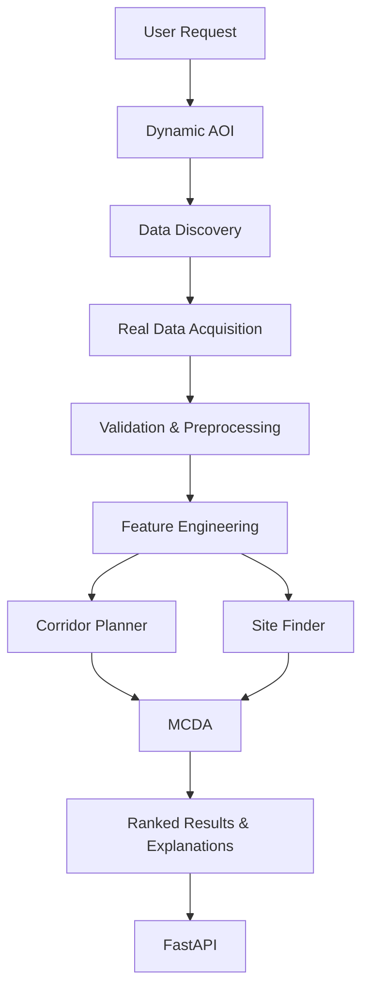

# InfraDrishti

InfraDrishti is a geospatial decision-support platform designed to help planners identify suitable infrastructure corridors and candidate sites using real-world spatial data and deterministic geospatial analysis.

## Overview

InfraDrishti solves the problem of manual, opaque, and data-disconnected early-stage infrastructure planning. It provides a programmatic pipeline for generating, screening, and ranking candidate locations for new linear infrastructure (corridors) and point infrastructure (sites) using real-world topographical, environmental, and demographic data. It produces comprehensive geospatial results (GeoJSON), cost surfaces (TIFF), and transparent multi-criteria decision analysis (MCDA) explanations.

## Core Capabilities

### Corridor Planner

Given an origin, destination, infrastructure type, and corridor width, InfraDrishti generates and ranks candidate NEW infrastructure corridors using:

- real geospatial datasets
- cost-surface analysis
- hard spatial constraints
- `MCP_Geometric` least-cost path analysis
- multiple alternative corridor generation
- physical corridor buffering
- corridor impact metrics
- transparent weighted MCDA ranking
- explanations

**This is NOT an existing-road navigation router.** It computes entirely new paths through physical space based on terrain and constraints.

### Site Finder

Given a target location/AOI, facility/infrastructure type, and required land area, InfraDrishti identifies spatially contiguous candidate sites and ranks them using:

- contiguous candidate areas
- spatial constraints
- proximity analysis
- impact metrics
- MCDA ranking
- explanations

*Note: The candidate sites are physical land units generated from spatial constraints, not legal/cadastral parcels.*

## Architecture



## Data Sources

The platform dynamically integrates several global datasets:

- **OpenStreetMap**: Building footprints and road networks (dynamically acquired via Geofabrik/OSM)
- **Copernicus DEM GLO-30**: 30m global digital elevation model for slope and terrain analysis
- **ESA WorldCover 2021**: Land cover classification (e.g., Cropland detection via class 40)
- **WorldPop**: Global 100m population grids for estimating exposure
- **HydroRIVERS**: River networks for crossing and distance analysis
- **HydroBASINS**: Hydrological basin boundaries
- **JRC Global Surface Water**: Surface water extent and occurrence
- **WDPA / WD-OECM**: World Database on Protected Areas for environmental constraints

## Dynamic Data Lifecycle

1. **Request**: User submits an AOI or origin/destination bounding box.
2. **Discover**: The system identifies required coverage footprints.
3. **Acquire**: It downloads required tiles/archives or reuses validated local data from `data/raw/`.
4. **Preprocess**: Raw data is clipped, reprojected, and rasterized/vectorized into `data/interim/`.
5. **Analyze**: Features are built into `data/processed/` and fed into the scoring algorithms.
6. **Output**: Results are generated into `outputs/` alongside provenance metadata.
7. **Clean**: Request-specific temporary workspaces in `runtime/` are pruned.

## Spatial Analysis

The core backend implements:
- 50m planning grid standard
- Automated localized UTM CRS projection
- Cost surface generation and hard physical constraints
- `MCP_Geometric` graph-based routing for alternatives
- Route diversification through path-penalty iteration
- Connected component analysis for site suitability
- Distance transforms and kernel convolutions for proximity
- Raster/vector preprocessing pipeline
- Multi-Criteria Decision Analysis (MCDA)

## Corridor Metrics

The corridor planner computes:
- route length (km)
- corridor area (hectares)
- building impact
- population exposure
- slope / elevation changes
- river crossings
- protected-area overlap
- land-cover impact (e.g. agriculture footprint)
- infrastructure distances
- acquisition_friction_index

## Site Metrics

The site finder computes:
- site area (hectares)
- slope
- infrastructure distances (roads, etc.)
- population exposure
- building impact
- land cover composition
- water proximity
- protected area overlap
- acquisition_friction_index

## Acquisition Friction Index

The `acquisition_friction_index` is a spatial screening proxy used to estimate land acquisition difficulty. It is derived using a heuristic formula incorporating building density, agricultural presence (cropland), and proximity to existing infrastructure.

**Important:** It is a spatial screening proxy only. It is NOT an ownership probability, acquisition probability, legal ownership verification, compensation prediction, or financial acquisition cost.

## API

The backend exposes a FastAPI service containing the following core endpoints:

- **`POST /project`**
  - **Purpose**: Initializes the workspace.
  - **Response**: `{"status": "Project initialized", "message": "Using local workspace"}`

- **`POST /corridor/plan`**
  - **Purpose**: Generates and ranks alternative infrastructure corridors.
  - **Body**: `CorridorRequest` (origin, destination, type, width, etc.)
  - **Response**: Ordered list of candidate corridors with full metrics and GeoJSON geometries.
  - **Errors**: `500 Internal Server Error` on processing failure.

- **`POST /site/find`**
  - **Purpose**: Identifies contiguous candidate sites matching requirements.
  - **Body**: `SiteRequest` (target location, area, requirements)
  - **Response**: Ordered list of candidate sites with metrics and GeoJSON bounding geometries.
  - **Errors**: `500 Internal Server Error` on processing failure.

## Repository Structure

```text
InfraDrishti/
├── backend/
│   ├── configs/
│   ├── outputs/
│   │   └── .gitkeep
│   ├── runtime/
│   │   └── .gitkeep
│   ├── scripts/
│   │   ├── diagnostics/
│   │   ├── maintenance/
│   │   ├── setup/
│   │   └── run_full_pipeline.py
│   ├── src/
│   │   ├── acquisition/
│   │   ├── api/
│   │   ├── core/
│   │   ├── corridor/
│   │   ├── geospatial/
│   │   ├── inference/
│   │   ├── ml/
│   │   ├── models/
│   │   ├── preprocessing/
│   │   ├── scoring/
│   │   └── site/
│   ├── tests/
│   │   ├── integration/
│   │   └── test_api.py
│   ├── environment.yml
│   └── requirements.txt
├── frontend/
│   └── .gitkeep
├── .gitignore
└── README.md
```

## Installation

The backend heavily relies on geospatial C-libraries (GDAL, GEOS, PROJ). Therefore, **Conda is the strictly supported installation path on Windows**. 

*Note: Pure `pip install -r requirements.txt` on Windows will likely fail due to missing binary wheels for `fiona`, `rasterio`, and `geopandas` on modern Python versions. Use `environment.yml`.*

### Backend Setup

```bash
git clone https://github.com/suryadeepbanerjee/InfraDrishti.git
cd InfraDrishti/backend

# Create and activate the environment using Conda
conda env create -f environment.yml
conda activate intradrishti-env
```

### Environment Variables

The following environment variable can be configured optionally to speed up elevation dataset downloads:

- `OT_API_KEY`: OpenTopography API Key. (Optional) Accelerates DEM acquisition. Set this via your local `.env` file or export it in your terminal.

## Running the Backend

Start the FastAPI application from the `backend/` directory:

```bash
cd backend/
conda activate intradrishti-env
uvicorn src.main:app --host 0.0.0.0 --port 8000
```
*(The health endpoint is available at `/` or `/health` depending on the `src.main` router configuration).*

## Running Tests

Integration and unit tests are written using `pytest`. From the `backend/` directory run:

```bash
pytest tests/
```

- Tests in `tests/integration/` (such as `test_backend_final.py` and `test_dynamic.py`) validate the end-to-end corridor and site pipelines.
- **Warning:** Some integration tests will dynamically download real spatial data (e.g. WorldCover tiles, OSM data) if it is not already cached in `data/raw/`. They require network access.

## Data Handling

Multi-GB geospatial datasets are explicitly **NOT** committed to this Git repository.
- **Caching**: The system maintains a local cache in `backend/data/raw/`.
- **Dynamic Acquisition**: Missing data for an AOI is dynamically acquired at runtime.
- **Workspaces**: Request-specific interim processing is isolated in `backend/runtime/` and pruned upon completion.

## Outputs

Analysis results are saved locally in the `backend/outputs/` directory. Generated contents are intentionally ignored by Git. Output files include:
- `routes.geojson` / `sites.geojson`: Geospatial geometries.
- `routes.csv` / `sites.csv`: Tabular metrics.
- `route_explanations.json`: MCDA decision transparency logic.
- `route_cost_surface.tif`: The combined raster cost surface used for routing.
- `processing_summary.json`: Provenance metadata and execution timings.

## Limitations

- Population impacts are modeled estimates derived from WorldPop grids, not exact census counts.
- `acquisition_friction_index` is a spatial screening proxy, not a legal assessment.
- Completeness of roads and buildings depends heavily on OpenStreetMap coverage in the target AOI.
- Results are planning-support guides intended for early-stage screening.

## Security

- All API keys and credentials must be supplied via environment variables. None are committed.
- Ensure that you do not accidentally commit downloaded `.tif`, `.pbf`, or `.zip` datasets. The `.gitignore` is pre-configured to prevent this.

## Development Workflow

1. Clone the repository.
2. Initialize the Conda environment.
3. Use `backend/scripts/run_full_pipeline.py` or diagnostic scripts to run CLI-based tests without spinning up FastAPI.
4. Add frontend code inside the isolated `frontend/` directory.

## Frontend

Frontend directory is reserved for the companion frontend implementation. Currently, it is a placeholder.

## Project Status

- **Backend**: Validated
- **Frontend**: Under separate development

## Disclaimer

InfraDrishti is a planning-support and decision-support tool. It is NOT:
- legal ownership verification
- cadastral parcel verification
- final engineering design
- environmental clearance
- acquisition probability prediction
- compensation estimation

All real-world infrastructure decisions require appropriate survey, engineering, environmental, legal, and administrative validation.
